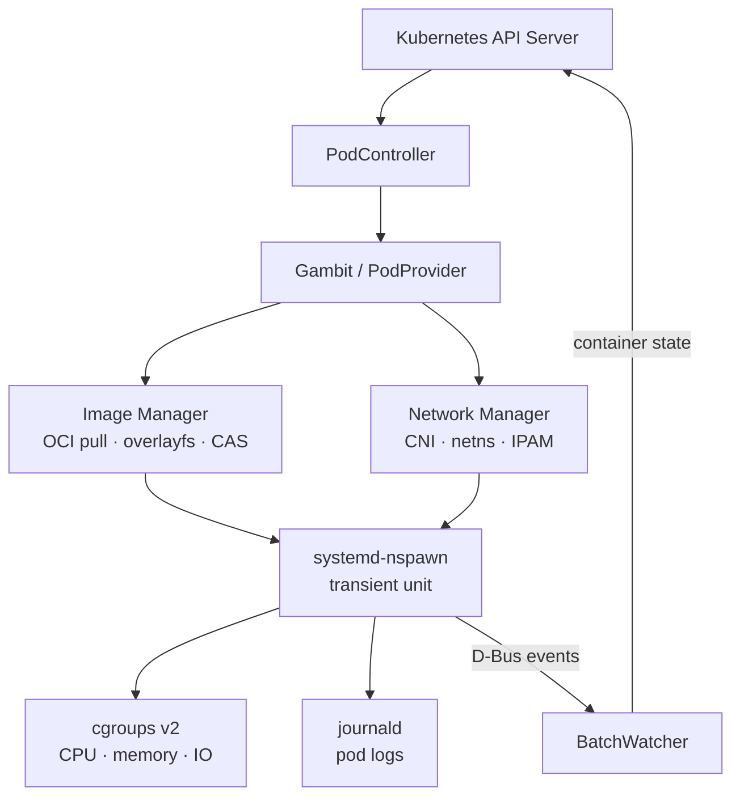

# Periapsis

A Kubernetes node agent that runs pods as native systemd-ns**pawn** containers, bypassing CRI and containerd entirely. One physical host can register as multiple independent virtual nodes (Pawns), each with isolated networking, pod lifecycle, and cgroup tree.

---

## The Problem

### High-density bare metal

Running Kubernetes on bare metal at high density is harder than it should be. A standard kubelet has a hard 110-pod limit and carries containerd, runc, and their shim layer with it. When you have powerful servers in expensive, space-constrained datacenters, you want thousands of pods per host - not hundreds.

The typical workaround is painful: deploy vSphere or KVM on the bare metal, provision VMs with KubeVirt or similar, then run kubelets inside those VMs. You get density, but at the cost of two extra abstraction layers, two control planes to maintain, and a debugging surface that requires specialists across Kubernetes, the hypervisor, and networking just to diagnose a single issue.

Periapsis takes a different approach. A single perigeos daemon registers the host as multiple virtual nodes directly in the Kubernetes API. Pods run as systemd transient units - no hypervisor, no extra control plane, one process to debug.

### Lightweight nodes

On a small VPS or edge machine, the standard Kubernetes stack is heavy before you run a single workload. kubelet alone consumes significant RAM (around 300 MB), Cilium CNI consumes around 300 MB, and containerd adds ~20MB per running pod on top. On a 700MB VPS that leaves little room for actual work.

Perigeos runs at ~67MB RSS idle and adds negligible per-pod overhead - no containerd shim per container, no separate daemon per runtime operation. On resource-constrained nodes it's a straightforward drop-in: same Kubernetes API, same kubectl, same pod specs, without the weight of the CRI stack.

### The "Private Fargate" Use Case (Serverless Bare Metal)

Public cloud providers (like AWS Fargate or Google Cloud Run) popularized the "serverless container" model: developers submit a Pod spec, and the infrastructure magically provisions the exact compute required in the background. You don't manage worker nodes, you just pay for what the container uses.

Under the hood, these platforms intercept pod assignments using the exact same virtual node concepts Periapsis uses. But because public clouds host hostile, untrusted code from strangers, they take a massive performance penalty by booting a dedicated microVM (like Firecracker) for every single pod.

**Periapsis provides that same "serverless" developer experience, but optimized for trusted, internal infrastructure.**

Because you aren't running code for hostile strangers, you don't need microVMs. When a Pod is scheduled to a Periapsis Pawn, the could daemon intercepts it and instantly carves out the exact requested CPU and memory using a `systemd-nspawn` transient unit and a `cgroups v2` slice.

The result is a **Fargate-in-a-box** architecture:
*   **For developers:** The UX is identical to Fargate. They just write Pod specs and deploy. The control plane abstracts the physical hardware away.
*   **For infrastructure:** You get zero hypervisor tax. You pack thousands of dynamically-sized pods onto bare metal at maximum density, with the exact resource enforcement of a serverless cloud, without paying the per-second cloud premium.

---

### Why not Kata Containers or KubeVirt?

If standard Kubernetes density is a problem, the industry default answer is usually microVMs (Kata Containers) or running VMs inside Kubernetes (KubeVirt). 

Those projects use **hardware-level virtualization** (KVM, QEMU, Firecracker). They boot a tiny, isolated Linux kernel for every single pod. This is the correct architecture if you are building a public cloud with hostile multi-tenancy (where a malicious user might try a kernel exploit to access another user's data). 

But hardware virtualization carries a massive tax: memory overhead per pod, boot-time latency, and CPU context-switching jitter. 

Periapsis chooses **OS-level isolation**. By relying strictly on Linux namespaces and `systemd-nspawn`, workloads share the host kernel. You trade hostile multi-tenant isolation for extreme compute density. For internal company infrastructure, CI/CD pipelines, or edge compute-where you trust the code but want to maximize hardware ROI-paying the microVM tax is a waste of resources. Periapsis gives you the density of raw bare-metal processes with the operational UX of Kubernetes.

---

## How It Works

Periapsis is a fork of virtual-kubelet that registers as a virtual Kubernetes node (Pawn), accepts pod assignments from the control plane, and manages the full container lifecycle: image pull (with p2p layer sharing), network setup (only Constellation CNI), resource limits, exec, logging, and status reporting.

The runtime is `systemd-nspawn`:

- **systemd transient units** - pods are machines in `machinectl`, logs go to journald
- **overlayfs** - OCI images extracted once into CAS, shared across pods via copy-on-write layers
- **cgroups v2** - CPU, memory, and IO limits enforced by the kernel directly
- **CNI** - per-pod network namespaces; Constellation (Cilium fork) for cross-host eBPF routing
- **userns mapping**

### Multi-pawn architecture

One host registers as N virtual nodes. Each pawn has its own TLS certificate, pod CIDR, and cgroup slice. The Kubernetes scheduler treats them as independent nodes. This is how a single physical machine runs 2000 pods while the scheduler still thinks it's talking to 30 separate nodes.

```
engix99 (Xeon E5-2690 v4)
├── compute-00  (pawn)
├── compute-01  (pawn)
├── ...
└── compute-29  (pawn, 30 total)

engifire (Intel N150)
├── engifire-pawn-01
└── engifire
```

---

## Performance

**2000 nginx replicas across 2 physical hosts, 32 virtual nodes:**

### Standard Kubelet vs. Periapsis

| Metric                          | Standard Kubernetes (Kubelet + containerd)                | Periapsis (Perigeos + systemd)                         |
|:--------------------------------|:----------------------------------------------------------|:-------------------------------------------------------|
| **Idle Daemon Footprint**       | ~350 MB (kubelet + containerd + shims)                    | ~67 MB (perigeos daemon)                               |
| **Per-Pod Memory Tax**          | ~15–20 MB (`containerd-shim` process per pod)             | < 1 MB (native `systemd` transient unit)               |
| **Max Pods per Physical Host**  | 110 (hard limit without heavy tuning hacks)               | Thousands (limited only by physics and subnet size)    |
| **Virtualization/Isolation**    | OS-level (runc) or HW-level (Kata/Firecracker)            | OS-level natively tied to Linux init (`nspawn`)        |
| **Logging Backend**             | Text files (`json-file` / CRI logs)                       | Native `journald` (queryable via `journalctl`)         |
| **Process Visibility**          | Opaque (requires `crictl` or `ctr`)                       | Transparent (visible in `machinectl` and `systemctl`)  |
| **Daemon Upgrades**             | Disruptive (requires draining node or risking state loss) | Zero-downtime (`KillMode=process` leaves pods running) |
| **cgroups v2 support**          | Limited, only CPU and RAM                                 | Full                                                   |
| **P2P layer sharing**           | No                                                        | Yes                                                    |
| **More events in the describe** | Standard                                                  | Events about image pulling %, etc                      |

```
10,763 RPS  ·  229µs median latency  ·  0.00% errors  ·  2.26M requests
p95 = 12.67ms  ·  p99 < 2s  ·  1000 concurrent VUs
```

Pawn hit distribution (even spread, no hotspots):
```
engifire-pawn-01    4.4%  (100,113 hits)
engifire            4.3%  ( 97,503 hits)
compute-27          4.3%  ( 97,052 hits)
...
compute-22          1.8%  ( 40,923 hits)
```

Daemon RSS: ~67–200 MiB (varies by pawn and pod count), running Constellation and Envoy GW. Compared to a standard Kubelet + Cilium and Envoy GW + containerd footprint of ~400-700 MiB.

Full results: [docs/show-off.md](docs/show-off.md)

---

## What Works

- Pod lifecycle: create, update, delete, restart policies, crash loop backoff
- Init containers and sidecar containers
- OCI image pull with layer caching and peer-to-peer layer sharing
- ConfigMap, Secret, emptyDir, projected volumes, downward API (Tidal)
- exec, attach, logs, port-forward (Kubelet API)
- Resource limits (CPU, memory, IO) via cgroups v2
- Liveness, readiness, and startup probes
- Environment variable injection including service discovery vars
- Multi-pawn host registration (N virtual nodes per host)
- Constellation CNI: eBPF datapath, VXLAN cross-host routing (with local bypass), per-pod netns
- Envoy Gateway for L7 ingress via Gateway API
- SeaweedFS CSI
- journald integration - pod logs visible in journalctl
- machinectl integration - running pods visible as machines
- `apsis` CLI for introspection, debugging, and reconciliation
- KillMode=process - `systemctl restart perigeos` leaves pods running while restaring the daemon

## What Does Not Work Yet

- **PersistentVolumeClaims**: local-path provisioner works; SeaweedFS CSI works; Other distributed CSI drivers untested
- **SecurityContext**: unprivileged pods work; full SecurityContext field coverage is incomplete - not all fields map cleanly to systemd-nspawn
- **Windows**: not supported, not planned
- **Non-systemd Linux**: not supported
- **StatefulSets with stable network identity**: untested at scale
- **VolumeSnapshot, ephemeral inline volumes**: not implemented
- **Vertical Pod Autoscaler**: untested

That being said, Periapsis supports **coexistance** with standard kubelet (or k3s node), given you're willing to deploy Constellation CNI.

---

## Naming

| Name              | Role                                                                         |
|-------------------|------------------------------------------------------------------------------|
| **Periapsis**     | The project (closest orbital approach - generic)                             |
| **Perigeos**      | The daemon binary (Earth-specific periapsis)                                 |
| **Pawn**          | A virtual Kubernetes node - wordplay on systemd-ns**pawn** - new concept IMO |
| **Gambit**        | The PodProvider implementation                                               |
| **Constellation** | Cilium-based CNI fork for multi-pawn networking                              |
| **Apsis**         | CLI for introspection and debugging                                          |
| **Tidal**         | Downward API                                                                 |

---

## Requirements

- Linux with systemd v250+ (later v260+) and cgroups v2
- Kernel 5.15+ (eBPF features used by Constellation)
- Kubernetes 1.34+
- Go 1.26+ (to build)

Optional: Constellation CNI for cross-host pod networking and multi-pawn isolation. Without it, pods use veth bridges on the host network namespace - single-pawn deployments only.

---

## Quick Start

### Prerequisites
- Running k8s or k3s control plane
- kubeconfig for initial node registration

### Build

```bash
go build ./cmd/perigeos
go build ./cmd/apsis
make -C cmd/userns-shim userns-shim-amd64
```

### Deploy

```bash
# Install systemd service and binary
./deploy/perigeos-install.sh

# Start
systemctl start perigeos

# Verify
kubectl get nodes
apsis status
```

Config: `/etc/apsis/perigeos/perigeos.toml`

State: `/var/lib/apsis/perigeos`

Logs: `journalctl -u perigeos`

For CNI-backed multi-pawn deployments, apply manifests from `deploy/constellation/`.
For L7 ingress, apply `deploy/envoy/` (GatewayClass, EnvoyProxy, Gateway, HTTPRoute).

### Verify

```bash
kubectl get nodes
kubectl run test --image=busybox --restart=Never -- sleep 3600
kubectl exec -it test -- sh

apsis status
apsis doctor
```

---

## Architecture



Key paths:
- `cmd/perigeos/main.go` - entrypoint, wires all controllers
- `node/lifecycle.go` - pod creation: CNI -> init containers -> app containers
- `node/batchwatcher.go` - container state polling and status push
- `node/podstore.go` - in-memory pod state registry
- `internal/runtime/systemd/` - systemd-nspawn machine management
- `internal/image/` - OCI pull, overlayfs extraction, layer cache
- `internal/network/` - CNI setup, Constellation integration
- `node/api/` - Kubelet HTTP API (exec, logs, port-forward)
- `adr/` - architecture decisions with full rationale

## Security: Root in the Pod is not Root on the Host

Because Periapsis bypasses the standard Container Runtime Interface (CRI) and runs pods directly on the host systemd, container breakout is a valid concern. If a container runs as `root` and escapes the namespace, does it have `root` on the physical bare-metal host?

No. Periapsis leverages systemd's native User Namespace mapping to decouple container privileges from host privileges. 

When a pod requires `root` (UID 0) internally, `perigeos` maps that container's UID 0 to an unprivileged, high-number UID on the host machine (e.g., UID 100000). 
*   **Inside the pod:** The application thinks it is root. It can bind to port 80, manage its own filesystem, and run standard containerized daemons.
*   **On the host kernel:** The application is running as a completely unprivileged user. Even in the event of a severe container escape, the kernel treats the rogue process as a nobody, completely neutralizing the threat to the underlying host and other Pawns.

*(See ADR-0010 for the deep dive on UID/GID mapping implementation).*

---

## Architecture Decisions

See `adr/` for full records. Notable:

- **ADR-0002**: Monorepo split - gambit.go -> lifecycle.go, hydration.go, status.go, exec.go, saga.go
- **ADR-0009**: KillMode=process - perigeos restarts leave pods running; zero-downtime upgrades
- **ADR-0010**: UID/GID mapping for unprivileged containers

---

### What is a Pawn?

The name "Pawn" is a nod to both `systemd-nspawn` and the chess piece: lightweight, numerous, and expendable.

In standard Kubernetes, there is a 1:1 relationship between a Node and a physical machine (or VM). Because of API overhead, IP allocation limits, and scheduler design, Kubernetes enforces a soft limit of 110 pods per Node.

If you have a massive 128-core, 1TB RAM bare-metal server, the 1:1 mapping is a massive bottleneck. The server can easily run 3,000 lightweight pods, but standard Kubernetes will stop sending workloads after 110.

**A Pawn breaks the 1:1 mapping. It is a virtual Node that multiplexes a single physical server.**

When you boot the `perigeos` daemon on a host, it doesn't register the host itself. Instead, it registers multiple independent Pawns (e.g., `compute-00` through `compute-29`).

To the Kubernetes Control Plane, a Pawn looks exactly like a standard physical server. It has:
- Its own Node capacity (CPU/RAM limits, IO limits).
- Its own unique TLS certificate for the Kubelet API.
- Its own dedicated Pod CIDR block for IP routing.
- Its own heartbeat and readiness status.

Under the hood on the Linux host, a Pawn is just a logical grouping. Each Pawn gets its own parent `cgroup v2` slice, and its network namespace is wired up by Constellation. When the scheduler assigns a pod to `compute-xx`, the `perigeos` daemon gets it, drops it into `compute-xx`'s cgroup slice, and boots it via `systemd-nspawn`.

By splitting one physical machine into 30 Pawns, the Kubernetes scheduler natively distributes thousands of pods across your bare metal without ever hitting the 110-pod threshold, requiring zero modifications to the control plane.

### Nodes as Cattle, Not Pets

In modern infrastructure, we treat containers as "cattle" (expendable and easily replaced) rather than "pets" (individually nurtured). However, in bare-metal Kubernetes deployments, the massive physical worker nodes often revert to being pets. They require heavy state management (`kubelet`, `containerd`), complex upgrade cycles, and if one goes down, it takes a massive blast radius with it.

Periapsis takes the "cattle" philosophy and applies it to the nodes themselves.

The name **Pawn** reflects this perfectly.

Because a Pawn is just a lightweight software abstraction rather than a heavy daemon, you can treat them with complete indifference:
*   You don't upgrade a Pawn; you just restart the `perigeos` daemon.
*   Because of `KillMode=process`, you can recycle the daemon in milliseconds, and the Pawns instantly re-register with the control plane while the underlying pod processes (the `systemd-nspawn` units) never drop a single request.
*   The physical server is no longer a "Kubernetes Node" you have to care for. It is just a pool of compute, memory, and IO. The control plane only interacts with the Pawns.

---

## Related Projects

- [Constellation](https://github.com/malformed-c/constellation) - eBPF/Cilium CNI fork
- [virtual-kubelet](https://github.com/virtual-kubelet/virtual-kubelet) - upstream fork base (Apache 2.0)

---

Periapsis is licensed under BSL 1.1, see [LICENSE](LICENSE).

It incorporates a fork of virtual-kubelet by the VK authors (Apache 2.0).
See [NOTICES](NOTICES) for full third-party attribution.

Kubernetes is a trademark of The Linux Foundation.

:: Malformed C ::
