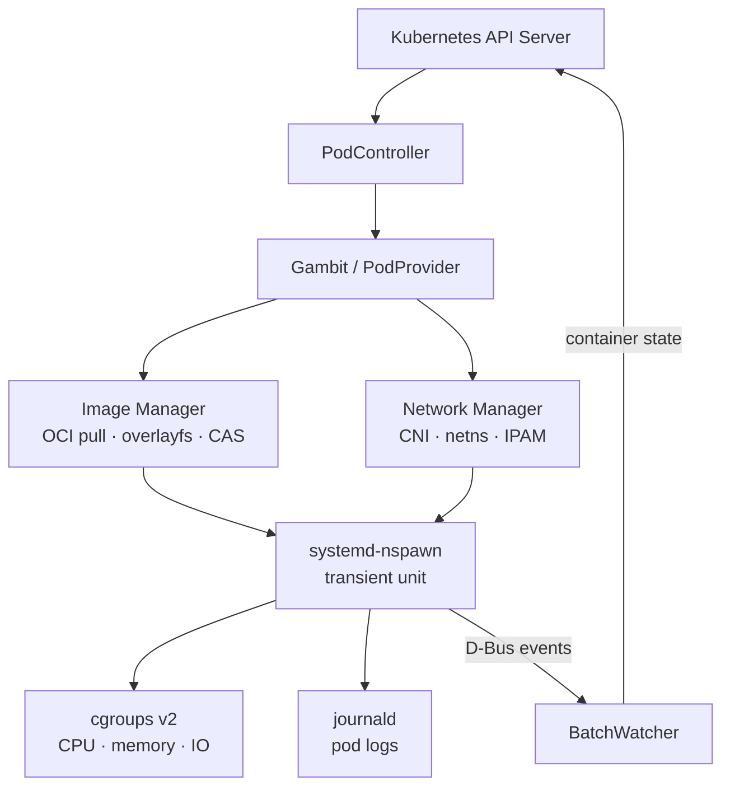

# Periapsis
A Kubernetes' Pawn
---

**High-density Kubernetes execution layer via `systemd-nspawn` machines.**

Periapsis is a Kubernetes node agent that bypasses the CRI and containerd entirely. It allows a single physical host to register as multiple independent virtual nodes (**Pawns**), each with its own isolated networking, pod lifecycle, and cgroup tree.

### Periapsis in Action

```bash
[engi@engix99 ~]$ sudo apsis status
Hostname:    engix99
Pawns:       30
Pods:        287
RSS:         177 MiB
Machines:    287
Netns:       298

[engi@engix99 ~]$ kubectl get nodes
NAME               STATUS   ROLES                   AGE   VERSION
compute-00         Ready    pawn                    42d   perigeos://dev
compute-01         Ready    pawn                    42d   perigeos://dev
...
compute-29         Ready    pawn                    42d   perigeos://dev
engix99            Ready    control-plane,primary   44d   v1.35.2+k3s1

[engi@engix99 ~]$ machinectl | head -2
MACHINE                                        CLASS     SERVICE        OS     VERSION
pod-01922ac2-44fe-4dcc-b0fc-53db356524bb-nginx container systemd-nspawn alpine 3.21.3
pod-021aa7a8-4ca8-44b3-8995-4b20b939f762-nginx container systemd-nspawn alpine 3.21.3
```

## Use Cases
- High-throughput CI/CD runners
- Edge/IoT resource-constrained devices
- local development clusters
- high-density internal microservices

---

## The Bottleneck

### High-density bare metal

Standard Kubernetes on bare metal faces a "density wall." A single `kubelet` has a hard limit of 110 pods and carries the heavy overhead of containerd, runc, and their shim layers. On powerful hardware, this forces a painful choice: either underutilize your servers or introduce complex hypervisor layers (KVM/vSphere/KubeVirt) that add latency and operational toil.

**Periapsis provides a "Serverless Bare Metal" architecture.** It delivers the developer experience of AWS Fargate - where the infrastructure is abstracted and pods are provisioned instantly - but optimized for trusted, internal infrastructure. By replacing the CRI stack with `systemd-nspawn` transient units, Periapsis removes the hypervisor tax and the pod-limit bottleneck.

### Lightweight nodes

On a small VPS or edge machine, the standard Kubernetes stack is heavy before you run a single workload. kubelet alone consumes significant RAM (around 300 MB), Cilium CNI consumes around 300 MB, and containerd adds ~20MB per running pod on top. On a 700MB VPS that leaves little room for actual work.

Perigeos runs at ~67MB RSS idle and adds negligible per-pod overhead - no containerd shim per container, no separate daemon per runtime operation. On resource-constrained nodes it's a straightforward drop-in: same Kubernetes API, same kubectl, same pod specs, without the weight of the CRI stack.

---

## How It Works

Periapsis is a fork of `virtual-kubelet` that manages the full container lifecycle natively on the host:
- image pull (with p2p layer sharing)
- network setup (only Constellation CNI)
- resource limits, exec, logging, and status reporting

### The Stack
- **Runtime:** systemd-ns**pawn** transient units registered with `systemd-machined`.
- **Storage:** OCI images extracted into a Content Addressable Store (CAS) and shared via **OverlayFS** copy-on-write layers.
- **Resources:** **cgroups v2** for strict CPU, memory, and IO enforcement.
- **Networking:** **Constellation CNI** (Cilium fork) providing eBPF datapath and VXLAN cross-host routing.
- **Security:** **User Namespace mapping** maps container root (UID 0) to an unprivileged high-number UID on the host, neutralizing container breakouts.

### Multi-pawn architecture

One host registers as N virtual nodes. Each pawn has its own TLS certificate, pod CIDR, and cgroup slice. The Kubernetes scheduler treats them as independent nodes. This is how a single physical machine runs 2000 pods while the scheduler still thinks it's talking to 30 separate nodes.

```
engix99 (Xeon E5-2690 v4)
├── compute-00  (pawn)
├── compute-01  (pawn)
├── ...
└── compute-29  (pawn, 30 total)

engifire (Intel N150)
├── engifire-pawn-01
└── engifire
```

---

## Performance Comparison

**Benchmark:** 2000 nginx replicas across 2 physical hosts, 32 virtual nodes.

| Metric | Standard K8s (Kubelet + containerd) | Periapsis (Perigeos + systemd) |
| :--- | :--- | :--- |
| **Idle Daemon Footprint** | ~350 MB | **~67 MB** |
| **Per-Pod Memory Tax** | ~15–20 MB (shim process) | **< 1 MB** (native unit) |
| **Max Pods per Host** | 110 (hard limit) | **Thousands** |
| **Isolation** | OS-level (runc) or HW-level (Kata) | OS-level (`nspawn`) |
| **Logging** | Text files (CRI logs) | **Native `journald`** |
| **Visibility** | Opaque (`crictl` / `ctr`) | **Transparent (`machinectl`)** |
| **Upgrades** | Disruptive (Drain node) | **Zero-downtime** node daemon upgrades |
| **P2P Layer Sharing** | No | **Yes** |

**Throughput:** `10,763 RPS` · `229µs median latency` · `0.00% errors`

Pawn hit distribution:
```
engifire-pawn-01    4.4%  (100,113 hits)
engifire            4.3%  ( 97,503 hits)
compute-27          4.3%  ( 97,052 hits)
...
compute-22          1.8%  ( 40,923 hits)
```

Daemon RSS: ~67–200 MiB (varies by pawn and pod count), running Constellation and Envoy GW.
Compared to a standard Kubelet + Cilium and Envoy GW + containerd footprint of ~400-700 MiB for kubelet itself + shim tax.

Full results: [docs/show-off.md](docs/show-off.md)

---

## Feature Matrix

- **Pod Lifecycle:** Create, update, delete, restart policies, crash loop backoff.
- **Advanced Pods:** Init containers, sidecars, and liveness/readiness/startup probes.
- **OCI image pull** with layer caching and peer-to-peer layer sharing
- **Storage:** ConfigMap, Secret, emptyDir, projected volumes, downward API (Tidal) and SeaweedFS CSI.
- **Kubelet API:** `exec`, `attach`, `logs`, and `port-forward`.
- **Resource limits** (CPU, memory, IO) via cgroups v2
 eBPF datapath, VXLAN cross-host routing, and Envoy Gateway (L7).

- Liveness, readiness, and startup probes
- Environment variable injection including service discovery vars
- Multi-pawn host registration (N virtual nodes per host)
- **Networking:**
  - Constellation CNI: eBPF datapath, VXLAN cross-host routing (with local bypass), per-pod netns
  - Envoy Gateway for L7 ingress via Gateway API
- journald integration - pod logs visible in journalctl
- machinectl integration - running pods visible as machines.
- **Management:** `apsis` CLI for introspection.

### ⚠️ What is in Progress/Unsupported
- **Dynamic Node Sizing**: Not implemented. Currently, Periapsis supports only **Static Pawn Provisioning**, where Pawn capacity and limits are manually defined in the daemon configuration by the operator.
- **OOM Eviction** Not yet implemented
- **PersistentVolumeClaims:** Local-path and SeaweedFS work; others untested.
- **SecurityContext**: unprivileged pods work; Partial coverage; not all fields map to `nspawn`
- **Windows**: not supported, not planned
- **Non-systemd Linux**: not supported
- **StatefulSets:** Stable network identity untested at scale.
- **VolumeSnapshot, ephemeral inline volumes**: not implemented
- **Vertical Pod Autoscaler**: untested

That being said, Periapsis supports **coexistance** with standard kubelet (or k3s node), given you're willing to deploy Constellation CNI.

Periapsis supports standard CNIs (Calico, Flannel, standard Cilium) out of the box for 1:1 node-to-host deployments. However, if you want to multiplex a single physical host into multiple virtual nodes (Pawn Slicing), you must use Constellation.

---

## Why not Kata Containers or KubeVirt?

If standard Kubernetes density is a problem, the industry default answer is usually microVMs (Kata Containers) or running VMs inside Kubernetes (KubeVirt). 

Those projects use **hardware-level virtualization** (KVM, QEMU, Firecracker). They boot a tiny, isolated Linux kernel for every single pod. This is the correct architecture if you are building a public cloud with hostile multi-tenancy (where a malicious user might try a kernel exploit to access another user's data). 

But hardware virtualization carries a massive tax: memory overhead per pod, boot-time latency, and CPU context-switching jitter. 

Periapsis chooses **OS-level isolation**. By relying strictly on Linux namespaces and `systemd-nspawn`, workloads share the host kernel. You trade hostile multi-tenant isolation for extreme compute density. For internal company infrastructure, CI/CD pipelines, or edge compute-where you trust the code but want to maximize hardware ROI-paying the microVM tax is a waste of resources. Periapsis gives you the density of raw bare-metal processes with the operational UX of Kubernetes.

---

## Naming

| Name | Role |
| :--- | :--- |
| **Periapsis** | The project name (closest orbital approach - generic) |
| **Perigeos** | The daemon binary (Earth-specific periapsis) |
| **Pawn** | A virtual Kubernetes node - wordplay on systemd-ns**pawn** - new concept IMO |
| **Gambit** | The PodProvider implementation |
| **Constellation** | Cilium-based CNI fork for multi-pawn networking |
| **Apsis** | CLI for introspection and debugging |

---

## Requirements

- systemd v250+ (later v260+) and cgroups v2 (should be already default)
- Kernel 5.15+ (eBPF features used by Constellation)
- Kubernetes 1.34+
- Go 1.26+ (to build)

- Optional: Constellation CNI for cross-host pod networking and multi-pawn isolation. Without it, pods use veth bridges on the host network namespace - single-pawn deployments only.
- Optional: Kernel arg `swapaccount=1` for swap enforcement

---

## Quick Start

### Prerequisites
- Running k8s or k3s control plane
- kubeconfig for initial node registration

### Build & Deploy
```bash
# Build binaries
go build ./cmd/perigeos
go build ./cmd/apsis
make -C cmd/userns-shim userns-shim-amd64

# Install and Start
sudo ./deploy/perigeos-install.sh
sudo systemctl start perigeos

# Verify
kubectl get nodes
sudo apsis status
```


Config: `/etc/apsis/perigeos/perigeos.toml`

State: `/var/lib/apsis/perigeos`

Logs: `journalctl -u perigeos`

For CNI-backed multi-pawn deployments, apply manifests from `deploy/constellation/`.
For L7 ingress, apply `deploy/envoy/` (GatewayClass, EnvoyProxy, Gateway, HTTPRoute).

### Verify

```bash
kubectl get nodes
kubectl run test --image=busybox --restart=Never -- sleep 3600
kubectl exec -it test -- sh

sudo apsis status
sudo apsis doctor
```

---

## Architecture



Key paths:
- `cmd/perigeos/main.go` - entrypoint, wires all controllers
- `node/lifecycle.go` - pod creation: CNI -> init containers -> app containers
- `node/batchwatcher.go` - container state polling and status push
- `node/podstore.go` - in-memory pod state registry
- `internal/runtime/systemd/` - systemd-nspawn machine management
- `internal/image/` - OCI pull, overlayfs extraction, layer cache
- `internal/network/` - CNI setup, Constellation integration
- `node/api/` - Kubelet HTTP API (exec, logs, port-forward)
- `adr/` - architecture decisions with full rationale

## Security: Root in the Pod is not Root on the Host

Because Periapsis bypasses the standard Container Runtime Interface (CRI) and runs pods directly on the host systemd, container breakout is a valid concern. If a container runs as `root` and escapes the namespace, does it have `root` on the physical bare-metal host?

No. Periapsis leverages systemd's native User Namespace mapping to decouple container privileges from host privileges. 

When a pod requires `root` (UID 0) internally, `perigeos` maps that container's UID 0 to an unprivileged, high-number UID on the host machine (e.g., UID 100000). 
*   **Inside the pod:** The application thinks it is root. It can bind to port 80, manage its own filesystem, and run standard containerized daemons.
*   **On the host kernel:** The application is running as a completely unprivileged user. Even in the event of a severe container escape, the kernel treats the rogue process as a nobody, completely neutralizing the threat to the underlying host and other Pawns.

*(See ADR-0010 for the deep dive on UID/GID mapping implementation).*

---

## Architecture Decisions

See `adr/` for full records. Notable:

- **ADR-0002**: Monorepo split - gambit.go -> lifecycle.go, hydration.go, status.go, exec.go, saga.go
- **ADR-0009**: KillMode=process - perigeos restarts leave pods running; zero-downtime upgrades
- **ADR-0010**: UID/GID mapping for unprivileged containers

---

## The "Pawn" Architecture

In standard Kubernetes, the relationship between a Node and a physical machine is 1:1. **A Pawn breaks this mapping.** 

Currently, Periapsis supports only **Static Pawn Provisioning**. The number of Pawns and their resource limits (CPU/Memory/IO) must be manually defined in the host configuration.

A Pawn is a virtual Kubernetes node that multiplexes a single physical server. When the `perigeos` daemon boots, it registers $N$ virtual nodes (e.g., `compute-00` through `compute-29`). To the Kubernetes Control Plane, these are independent servers with their own:
- **Capacity:** Dedicated CPU/RAM/IO limits, enforced by cgroups v2.
- **Identity:** Unique TLS certificates and Kubelet API.
- **Networking:** Dedicated Pod CIDR blocks.

**Nodes as Cattle:** Because Pawns are lightweight software abstractions, they are expendable. Using `KillMode=process`, the `perigeos` daemon can be restarted or upgraded in milliseconds without dropping a single request from the underlying `systemd-nspawn` pods.

---

## Related Projects

- [Constellation](https://github.com/malformed-c/constellation) - eBPF/Cilium CNI fork
- [virtual-kubelet](https://github.com/virtual-kubelet/virtual-kubelet) - upstream fork base (Apache 2.0)

---

Periapsis is licensed under BSL 1.1, see [LICENSE](LICENSE).
On 2030-04-27, it will transition to GPL-3.0.
What this means in practice:

Individual users, homelab enthusiasts, researchers, and internal company deployments can freely read, fork, modify, and run the code in production.
The license restricts offering Periapsis (or a substantially modified version) as a commercial hosted or managed service to third parties during the BSL period.

If you plan to build a commercial managed Kubernetes/edge platform on top of Periapsis and want to avoid the BSL obligations, please contact me to discuss a commercial license.

---

It incorporates a fork of virtual-kubelet by the VK authors (Apache 2.0).
See [NOTICES](NOTICES) for full third-party attribution.

Kubernetes is a trademark of The Linux Foundation.

`:: Malformed C ::`
